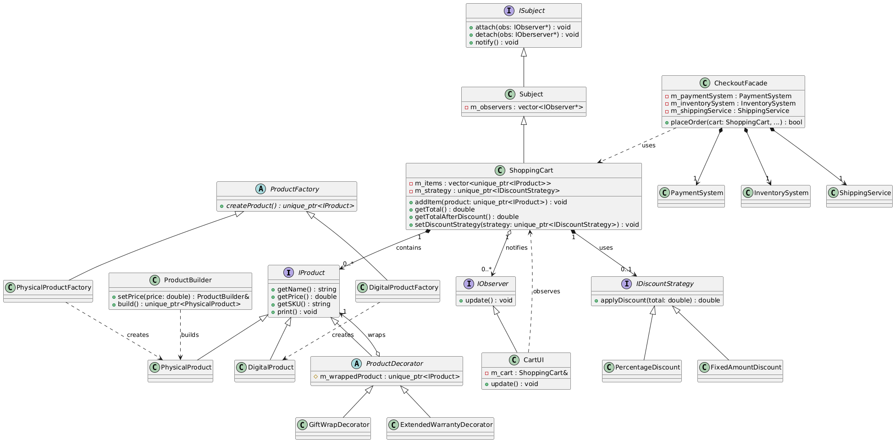
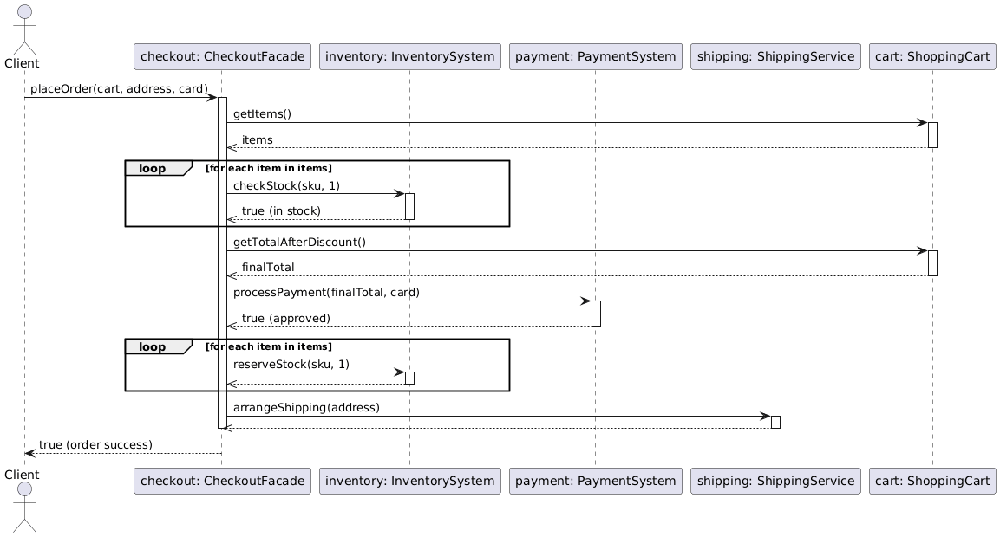

# SDP Final Project: E-Commerce Cart 🛒

This project was created for the Software Design Patterns course.
I chose to build a small e-commerce shopping cart system, because it’s a convenient way to show how multiple design patterns can work together inside one application.

Group: SE-2404

Subject: Software Design Patterns

Topic: E-Commerce Shopping Cart System

## 🚀 Project Overview

This is a console-based C++ application that simulates the basic behaviour of an online store’s shopping cart.
The goal wasn’t to build a full commercial product, but to clearly demonstrate how six different design patterns can be combined in one cohesive system.

The program lets you add items to the cart, apply discounts, decorate products with extra features, update the UI through observers, and finally run the checkout process through a simplified facade.

## 🛠️ Design Patterns Used

Here are the six patterns we implemented and how they fit into the system:

**Factory Method**

* **Used in:** `ProductFactory`
* **Purpose:** To create different product types (`DigitalProduct`, `PhysicalProduct`) without hardcoding them in the main logic.

**Builder**

* **Used in:** `ProductBuilder`
* **Purpose:** To construct complex products step by step, especially those with many optional parameters.

**Strategy**

* **Used in:** `DiscountStrategy`
* **Purpose:** To switch between different discount algorithms at runtime without changing the cart’s internal logic.

**Observer**

* **Used in:** `ShoppingCart` (subject) and `CartUI` (observer)
* **Purpose:** To automatically update the UI whenever the cart changes — for example, when an item is added or a discount is applied.

**Decorator**

* **Used in:** `ProductDecorator` and its extensions
* **Purpose:** To add optional features (like gift wrapping or extended warranty) to products dynamically and modify their price or name.

**Facade**

* **Used in:** `CheckoutFacade`
* **Purpose:** To provide a clean, simple method for placing an order, while hiding details like payment, shipping, and inventory checks.

## 📊 UML Diagrams

Here is a brief look at the project's architecture. (These PNG images are stored in the `/assets` folder).

### 1. Class Diagram

This diagram shows the **static structure** of the entire project. It visualizes all classes, interfaces, and their relationships (like inheritance or composition), showing how all six patterns fit together in one high-level map.

### 2. Sequence Diagram (Checkout Process)

This diagram shows the **dynamic behavior** of the **Checkout Facade**. It illustrates, step-by-step, how the `CheckoutFacade` object calls the `Inventory`, `Payment`, and `Shipping` subsystems in the correct order to process an order.

## ⚙️ Technology Used

* **C++17** (for smart pointers and modern language features)
* **CMake** (for building the project)
* **CLion** (recommended IDE, but any compiler works)

## 🏃‍♂️ How to Run the Project

The easiest way to run the project in CLion:

1.  Open CLion.
2.  Select **File → Open…**.
3.  Choose the entire `ECommerceProject` folder.
4.  Wait for CLion to load the `CMakeLists.txt` file.
5.  Press the green **Run** button (or **Shift + F10**).

The program will compile and execute the demonstration scenario from `main.cpp`.
All results will appear in the **Run** console.